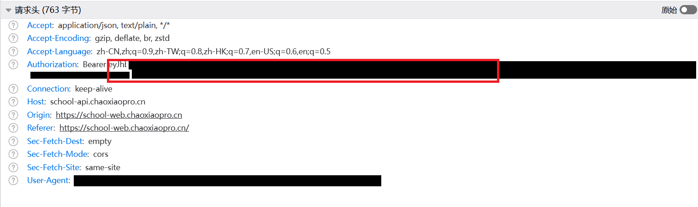
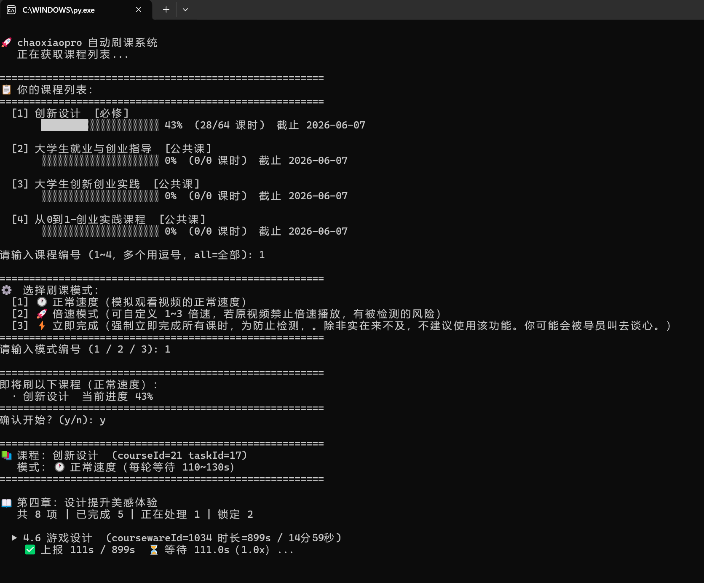

# 智教云/chaoxiaopro/芜湖微校的刷课脚本

[](https://www.python.org/) [](LICENSE) []()

一个基于 Python 的自动化学习辅助工具，适用于智教云 / chaoxiaopro.cn 在线课程平台，可实现：

* 📺 自动刷课
* 📝 自动完成章节测验（基础支持）
* ⏱ 模拟正常学习流程（降低检测风险）

> ⚠️ \*\*仅供个人学习与技术交流使用\*\*。使用本脚本造成的任何后果（账号被封、成绩无效等）由使用者自行承担。

> * ❌ 禁止用于商业用途或“付费代刷“

> * ❌ 禁止倒卖本项目

> * 💡 如你因购买此类服务被骗，请及时退款维权

## 准备

#### 方法一（推荐）：使用 Python 运行

1. 前往官网下载并安装 Python
   👉 [https://www.python.org/downloads/](https://www.python.org/downloads/)
2. 了解cmd，pip的基础用法

---

#### 方法二：直接运行 EXE

如果你不熟悉 Python，可前往 `Releases` 页面下载打包好的 `.exe` 文件（适用于 Windows）。

## 用法/示例

**1.保存项目到本地**
直接下载或克隆本仓库

**2.安装依赖**

```cmd
pip install -r requirements.txt
```

---

**3.编辑token.txt**（选择方法二的用户直接跳过前两个步骤）

1.登录学校的在线课程平台，（以芜湖职业技术大学为例，不同学校登录网站和接口可能不同）[https://school-web.chaoxiaopro.cn/student/]([https://](https://school-web.chaoxiaopro.cn/student/))
2.按下F12打开浏览器开发者工具，选择网络菜单。点击课程学习或其它界面。
3.在请求头找到 ``Authorization: Bearer xxxxxxxxxxxxxx``
4.复制 `Bearer` 后面的全部内容，粘贴到 `token.txt`

1. 复制 Bearer 后面的​**全部内容**​，粘贴到 token.txt 文件中

> ⚠️ Token 是你的账号凭证，请**不要分享**给任何人！Token 有有效期，过期需重新获取




**4.直接运行main.py**
如图按照提示操作，为防止后台检测。**不建议**使用立即完成和倍速模式。​**建议使用「常速模拟」模式**​，避免被平台检测。



---

### 免责声明

**仅供个人学习与技术交流使用，使用该脚本导致的成绩无效等后果，由使用者自行承担。本脚本仅为基本的抓包发包网络请求，不存在破解、逆向等违法操作**

